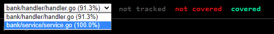
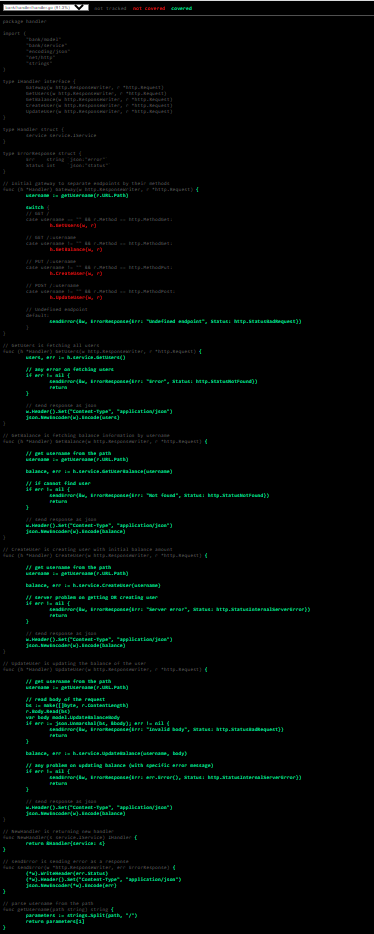
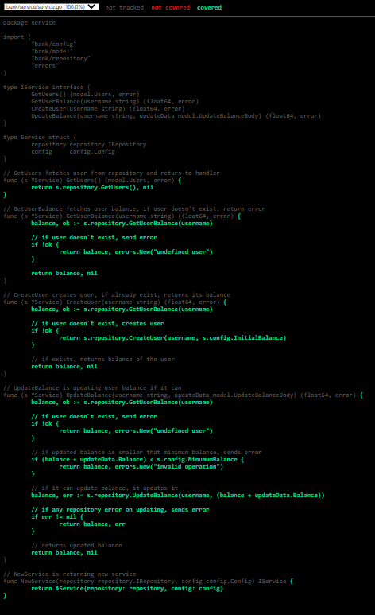

# Run tests

- just see converage on command line

```cmd
make cover
```

<br>

- see the html file

```cmd
make cover-show
```

<br>

# RESULT

### - Coverage of all files

<p align="center">
  
</p>

### - Handler covered codes

<p align="center">
  
</p>

### - Service covered codes

<p align="center">
  
</p>

# Week 6 Assignment

In this assignment, we expect to you develop a configurable backend service that having the following business requirements:

First of all, see [configuration file for local environment.](.config/local.json)

`GET /` endpoint should return all username and wallet balance.

`GET /:username` endpoint should return wallet balance of username.

`PUT /:username` endpoint should create a wallet by username. The initial value of balance will be set from configuration file as `initialBalanceAmount` variable. If the wallet exists, don't update existed wallet and return same response as created.

`POST /:username` endpoint should update wallet balance by `json` body.

- `{ "balance": POSITIVE_NUMBER }` should increase balance by `POSITIVE_NUMBER`
- `{ "balance": NEGATIVE_NUMBER }` should descrease balance by `NEGATIVE_NUMBER`. Wallet balance amount never belows `minimumBalanceAmount`. If decreased amount will below `minimumBalanceAmount` then you should return an error.

## Implementation

Backend service that having the following technical requirements:

- Use only Go's standart libraries.
- Implementation should be made with Layered Architecture:
  Controller(Handler)->Service->Data(Repository).
- Test coverage should be at least %85.
- Free to use any DB(In-Memory(no-db), SQL, NoSQL)
